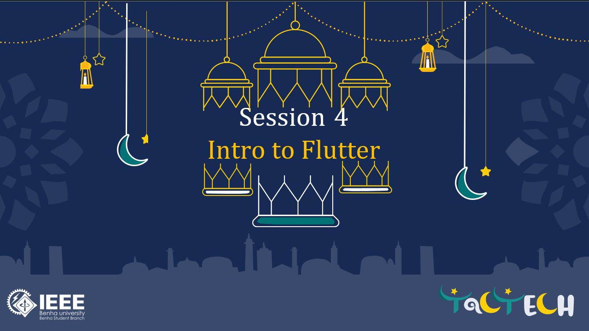
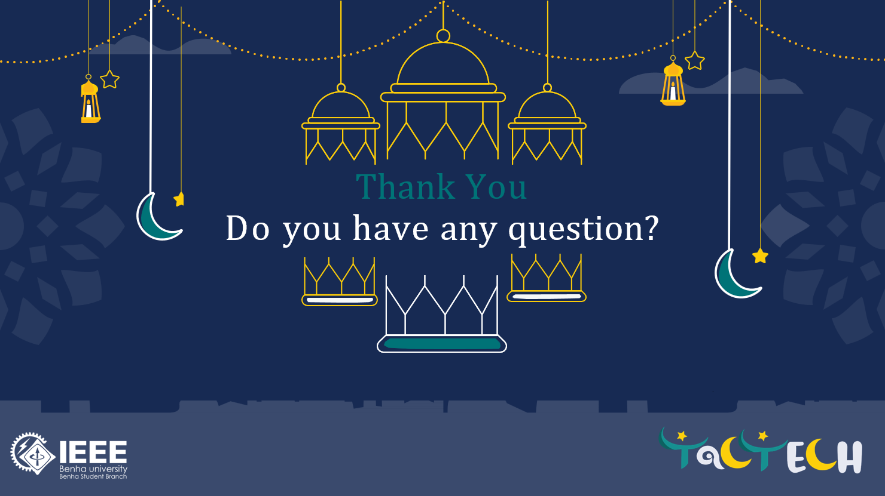

# Intro to Flutter

## About The Session

Welcome to the **Intro to Flutter** session! This workshop was delivered as part of the Ramadan Program at IEEE BUB. It is specifically designed for beginners aiming to understand the fundamentals of cross platform app development using Flutter.

## Topics Covered (Agenda)

During this session, we covered the following key topics:

- **What is Flutter:** An introduction to the framework and its advantages.
- **Project Structure:** Understanding the directories and files in a standard Flutter project.
- **Everything is a Widget:** The core philosophy of building UIs in Flutter.
- **Stateless vs Stateful:** Understanding the difference between widgets that manage state and those that do not.
- **Main & Layout Widgets:** Exploring the essential building blocks for creating interfaces.

## Core Concepts

Some of the essential takeaways from the slides include:

- **Hot Reload Benefits:** How Hot Reload accelerates the development process by instantly reflecting code changes in the app.
- **MaterialApp vs Scaffold:** Understanding the root of a Flutter app (`MaterialApp`) versus the fundamental structural layout for a screen (`Scaffold`).
- **Layouts (Row/Column/Stack):** The primary tools for arranging widgets horizontally, vertically, and overlapping them.

## Resources & Materials

This repository contains all the resources you need from the session:

- The full PowerPoint presentation slides.
- **Presentation Slides:** [view on Google Slides](https://docs.google.com/presentation/d/1CRsNEk2_WZOlaaoBEY-efiMUNyOEXyRU/edit?usp=sharing&ouid=117746034635602625537&rtpof=true&sd=true)

---

